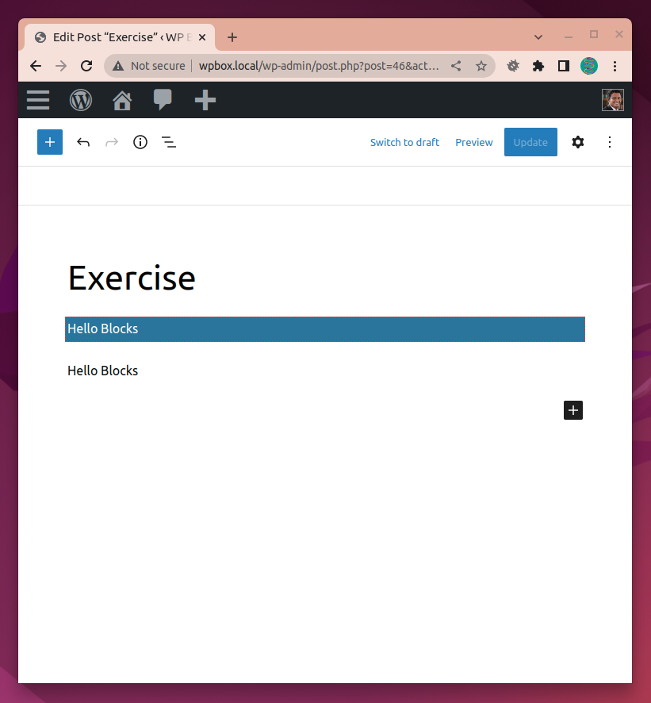

# Hello Blocks! Coding a custom block

https://wordpress.tv/2022/03/29/hello-blocks-coding-a-custom-block/

## What is a block?

Blocks are an abstract unit for structuring and interacting with content. When composed together they create the content for a webpage. Everything from a paragraph, to a video, to the site title is represented as a block.

```
<!-- wp:paragraph {"key": "value"} -->
<p>Welcome to the world of blocks.</p>
<!-- /wp:paragraph -->
```

https://developer.wordpress.org/block-editor/explanations/

